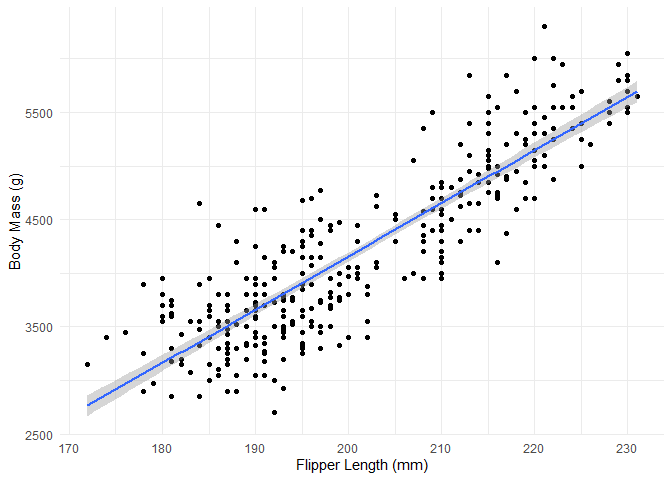

Team Troubleshooting Deliverable 3
================

## Attributions

Thanks to Icíar Fernández-Boyano for writing most of this document, and
Vincenzo Coia for his edits.

## Instructions

There are **10 errors** in this Rmd. Will you find them all? Errors are
marked by \#\# ERROR HERE \#\# in the code chunk in which they are
located. *There are no hidden errors in this worksheet*. Hint: You
should be able to knit the Rmd if all code is working correctly…but this
will only catch the errors in code, and not the errors in logic or
instruction-following\!

**Notes:**

  - **Each code chunk contains a maximum of one single error.**

  - Errors may be in the form of **broken code** (e.g. using `" "`
    inappropriately, which returns an error when running the code), but
    can also be **running code that does not follow the instructions**
    (e.g. the goal of the code was to filter the first 3 rows, but
    instead, the first 3 columns were selected). Read the Rmd commentary
    carefully to find these.

## Setup

Below, I load the packages that are required to run this worksheet.

### Exercise 1

By now, you should be familiar with tidy data. Here’s a *messy* tibble
with data regarding smoking habits in a small office.

``` r
(smoker <- tribble(
  ~smoker, ~male, ~female, ~`non-binary`,
  "yes", 21, 10, 1,
  "no", 20, 12, 2
))
```

    ## # A tibble: 2 x 4
    ##   smoker  male female `non-binary`
    ##   <chr>  <dbl>  <dbl>        <dbl>
    ## 1 yes       21     10            1
    ## 2 no        20     12            2

To tidy it, I want to make the data **longer** and store it into a new
variable called `smoker_tidy`. The variables/columns in the tidy version
of the data are:

  - `gender` (“female”, “male”, “non-binary”)
  - `smoker` (“yes”, “no”)
  - `count`, which is a non-negative integer representing the number of
    observations.

Remember that you should **always look at the output of your code** to
make sure it’s doing what you’re expecting.

Also remember that names that contain non-standard characters, like
dashes `-`, can be worked with by surrounding the name with backticks.

``` r
## Error 1 fixed
(smoker_tidy <- smoker %>%
  pivot_longer(c(male, female, `non-binary`), names_to = "gender", values_to = "count"))
```

    ## # A tibble: 6 x 3
    ##   smoker gender     count
    ##   <chr>  <chr>      <dbl>
    ## 1 yes    male          21
    ## 2 yes    female        10
    ## 3 yes    non-binary     1
    ## 4 no     male          20
    ## 5 no     female        12
    ## 6 no     non-binary     2

``` r
smoker_tidy
```

    ## # A tibble: 6 x 3
    ##   smoker gender     count
    ##   <chr>  <chr>      <dbl>
    ## 1 yes    male          21
    ## 2 yes    female        10
    ## 3 yes    non-binary     1
    ## 4 no     male          20
    ## 5 no     female        12
    ## 6 no     non-binary     2

### Exercise 2

Remember the `penguins` dataset? I want to explore the relationship
between `flipper_length_mm` and `body_mass_g` to see if there is a
linear relationship between the two. To do so, I will use `ggplot2` to
plot my data as a scatterplot where `x = flipper_length_mm` and `y =
body_mass_g`, and I will **add a regression line (straight line) showing
the confidence interval** using `geom_smooth()`.

Remdoneember that there can only be **one error** in a single code
chunk.

``` r
# ERROR 2 fixed
ggplot(penguins, aes(x = flipper_length_mm, y = body_mass_g)) +
  geom_point() +
  geom_smooth(method = "lm", se = TRUE) +
  theme_minimal() +
  labs(x = "Flipper Length (mm)",
       y = "Body Mass (g)")
```

    ## `geom_smooth()` using formula 'y ~ x'

    ## Warning: Removed 2 rows containing non-finite values (stat_smooth).

    ## Warning: Removed 2 rows containing missing values (geom_point).

<!-- -->

### Exercise 3

`lubridate` is a `tidyverse` package that makes dealing with dates &
times in R easy. It has a series of functions for parsing dates of a
known order. For example, `ymd()` will parse dates with a
*year-month-day* order, and `dmy()` will parse dates with a
*day-month-year* order. You can check `lubridate`’s documentation,
including parsing & manipulating dates, and instants, by running
`?lubridate`. You can try below:

``` r
?lubridate
```

    ## starting httpd help server ... done

With that said - time to work with some dates\! I have stored Rosalind
Franklin’s birth date under the variable `rs`, and I would like to parse
it using **the appropriate `lubridate` date function**, given the order
in which I have stored it.

``` r
# ERROR 3 fixed
rs <- "July 25, 1920"
mdy(rs)
```

    ## [1] "1920-07-25"

### Exercise 4

Being able to parse dates is nice, but `lubridate` is also very useful
when it comes to answering questions such as “How many seconds are in a
day?” or “How long has it been since…?”. For example, I want to
calculate how many *hours* it has been since the first landing on the
moon, until today.

``` r
# ERROR HERE - 4
date_landing <- mdy("July 20, 1969")
difftime(today(), date_landing, units = "hours")
```

    ## Time difference of 449184 hours

### Exercise 5

Now, how many *days* will it have been since the landing on the moon,
**in a week from now**?

``` r
# ERROR 5 FIXED
date_landing <- mdy("July 20, 1969")
difftime(today(), date_landing + weeks(1), units = "days")
```

    ## Time difference of 18709 days

### Exercise 6

The `palmerpenguins` dataset contains a tidy version of the dataset,
`penguins`, and an untidy version, `penguins_raw`. Now… remember
factors? In the words of Jenny Bryan, “factors are the variable type
that useRs love to hate.” It is how we store truly categorical
information in R; the values in a factor are called “levels”. They are
particularly useful when it comes to plotting data, and fitting models.
Which is why you should know how to use them\! `forcats` is the
`tidyverse` package that deals with factors.

Let’s have a quick look at the `penguins_raw` dataset. There are many
ways to do this, but I use `str()` because it is a fast way to see the
*class* of each of the columns within the dataset.

``` r
str(penguins_raw)
```

    ## tibble [344 x 17] (S3: tbl_df/tbl/data.frame)
    ##  $ studyName          : chr [1:344] "PAL0708" "PAL0708" "PAL0708" "PAL0708" ...
    ##  $ Sample Number      : num [1:344] 1 2 3 4 5 6 7 8 9 10 ...
    ##  $ Species            : chr [1:344] "Adelie Penguin (Pygoscelis adeliae)" "Adelie Penguin (Pygoscelis adeliae)" "Adelie Penguin (Pygoscelis adeliae)" "Adelie Penguin (Pygoscelis adeliae)" ...
    ##  $ Region             : chr [1:344] "Anvers" "Anvers" "Anvers" "Anvers" ...
    ##  $ Island             : chr [1:344] "Torgersen" "Torgersen" "Torgersen" "Torgersen" ...
    ##  $ Stage              : chr [1:344] "Adult, 1 Egg Stage" "Adult, 1 Egg Stage" "Adult, 1 Egg Stage" "Adult, 1 Egg Stage" ...
    ##  $ Individual ID      : chr [1:344] "N1A1" "N1A2" "N2A1" "N2A2" ...
    ##  $ Clutch Completion  : chr [1:344] "Yes" "Yes" "Yes" "Yes" ...
    ##  $ Date Egg           : Date[1:344], format: "2007-11-11" "2007-11-11" ...
    ##  $ Culmen Length (mm) : num [1:344] 39.1 39.5 40.3 NA 36.7 39.3 38.9 39.2 34.1 42 ...
    ##  $ Culmen Depth (mm)  : num [1:344] 18.7 17.4 18 NA 19.3 20.6 17.8 19.6 18.1 20.2 ...
    ##  $ Flipper Length (mm): num [1:344] 181 186 195 NA 193 190 181 195 193 190 ...
    ##  $ Body Mass (g)      : num [1:344] 3750 3800 3250 NA 3450 ...
    ##  $ Sex                : chr [1:344] "MALE" "FEMALE" "FEMALE" NA ...
    ##  $ Delta 15 N (o/oo)  : num [1:344] NA 8.95 8.37 NA 8.77 ...
    ##  $ Delta 13 C (o/oo)  : num [1:344] NA -24.7 -25.3 NA -25.3 ...
    ##  $ Comments           : chr [1:344] "Not enough blood for isotopes." NA NA "Adult not sampled." ...
    ##  - attr(*, "spec")=
    ##   .. cols(
    ##   ..   studyName = col_character(),
    ##   ..   `Sample Number` = col_double(),
    ##   ..   Species = col_character(),
    ##   ..   Region = col_character(),
    ##   ..   Island = col_character(),
    ##   ..   Stage = col_character(),
    ##   ..   `Individual ID` = col_character(),
    ##   ..   `Clutch Completion` = col_character(),
    ##   ..   `Date Egg` = col_date(format = ""),
    ##   ..   `Culmen Length (mm)` = col_double(),
    ##   ..   `Culmen Depth (mm)` = col_double(),
    ##   ..   `Flipper Length (mm)` = col_double(),
    ##   ..   `Body Mass (g)` = col_double(),
    ##   ..   Sex = col_character(),
    ##   ..   `Delta 15 N (o/oo)` = col_double(),
    ##   ..   `Delta 13 C (o/oo)` = col_double(),
    ##   ..   Comments = col_character()
    ##   .. )

Let’s change the `Sex` and `Species` columns - currently encoded as
character columns - into factors, and store the dataset with these
changes into a variable `penguins_new`.

``` r
penguins_new <- 
  penguins_raw %>%
  mutate(across(c(Sex, Species), as.factor))

levels(penguins_new$Species) # check output
```

    ## [1] "Adelie Penguin (Pygoscelis adeliae)"      
    ## [2] "Chinstrap penguin (Pygoscelis antarctica)"
    ## [3] "Gentoo penguin (Pygoscelis papua)"

Now, I noticed that the levels for the factor `Species` could be
simplified. Therefore, I want to **recode the levels** as follows, once
again saving these changes into the `penguins_new` dataset, more
specifically into the same column `Species`:

  - “Adelie Penguin (Pygoscelis adeliae)” to “Adelie”
  - “Chinstrap penguin (Pygoscelis antarctica)” to “Chinstrap”
  - “Gentoo penguin (Pygoscelis papua)” to “Gentoo”

<!-- end list -->

``` r
# ERROR 6 FIXED
penguins_new <-
  penguins_new %>%
  mutate(Species = recode(Species,
                          "Adelie Penguin (Pygoscelis adeliae)" = "Adelie",
                          "Chinstrap penguin (Pygoscelis antarctica)" = "Chinstrap",
                          "Gentoo penguin (Pygoscelis papua)" = "Gentoo"))
levels(penguins_new$Species) # check output
```

    ## [1] "Adelie"    "Chinstrap" "Gentoo"

### Exercise 7

So far, we’ve converted columns `Sex` and `Species` into factors. It is
common practice to convert **all character columns** into factors. Let’s
try that below; again, saving our changes into the `penguins_new`
dataset.

``` r
penguins_new <-
  penguins_new %>%
  mutate(across(where(is_character), as_factor))
```

Say I want to create a subset of the `penguins_new` dataset, that *only*
contains data for **female** penguins from the **Adelie** and **Gentoo**
species. Save this subset into `penguins_subset` and ensure that you
*drop all unused levels* from this new subset. Remember to *check the
output* to ensure that the code is doing what you expect it to do\!

``` r
# ERROR 7 FIXED
penguins_subset <-
  penguins_new %>%
  filter(Species %in% c("Adelie", "Gentoo") & Sex == "FEMALE") %>%
  droplevels() 
penguins_subset
```

    ## # A tibble: 131 x 17
    ##    studyName `Sample Number` Species Region Island Stage `Individual ID`
    ##    <fct>               <dbl> <fct>   <fct>  <fct>  <fct> <fct>          
    ##  1 PAL0708                 2 Adelie  Anvers Torge~ Adul~ N1A2           
    ##  2 PAL0708                 3 Adelie  Anvers Torge~ Adul~ N2A1           
    ##  3 PAL0708                 5 Adelie  Anvers Torge~ Adul~ N3A1           
    ##  4 PAL0708                 7 Adelie  Anvers Torge~ Adul~ N4A1           
    ##  5 PAL0708                13 Adelie  Anvers Torge~ Adul~ N7A1           
    ##  6 PAL0708                16 Adelie  Anvers Torge~ Adul~ N8A2           
    ##  7 PAL0708                17 Adelie  Anvers Torge~ Adul~ N9A1           
    ##  8 PAL0708                19 Adelie  Anvers Torge~ Adul~ N10A1          
    ##  9 PAL0708                21 Adelie  Anvers Biscoe Adul~ N11A1          
    ## 10 PAL0708                23 Adelie  Anvers Biscoe Adul~ N12A1          
    ## # ... with 121 more rows, and 10 more variables: `Clutch Completion` <fct>,
    ## #   `Date Egg` <date>, `Culmen Length (mm)` <dbl>, `Culmen Depth (mm)` <dbl>,
    ## #   `Flipper Length (mm)` <dbl>, `Body Mass (g)` <dbl>, Sex <fct>, `Delta 15 N
    ## #   (o/oo)` <dbl>, `Delta 13 C (o/oo)` <dbl>, Comments <fct>

### Exercise 8

In the remaining 3 exercises (8, 9, and 10), we will practice joins\!
First, let’s create a couple of tibbles that we can practice `dplyr`
joins with. This data is a subset of the `bechdel` movies dataset by
[FiveThirtyEight](https://github.com/fivethirtyeight/data/tree/master/bechdel).

``` r
movies <- tibble::tribble(
                                         ~movie,     ~bechdel_binary,      ~genre,                       ~distributor,
                              "American Hustle",              "pass",     "drama",      "Sony Pictures Entertainment",
                                  "Pacific Rim",              "fail",    "action",             "Warner Bros Pictures",
                             "The Great Gatsby",              "fail",     "drama",            " Warner Bros Pictures",
                                     "Hannibal",              "good",  "thriller",         "MGM Distribution Company",
 "Harry Potter and the Deathly Hallows: Part 1",              "pass",   "fantasy",             "Warner Bros Pictures",
                      "The Blair Witch Project",              "pass",    "horror",            "Artisan Entertainment",
                      "The Amazing Spider-Man",              "fail",    "fantasy",          "Sony Pictures Releasing"
  )

distributors <- tibble::tribble(
                          ~distributor, ~yr_founded,
         "Sony Pictures Entertainment",        1998,
                "Warner Bros Pictures",        1923,
            "MGM Distribution Company",        1924
  )
```

Join `movie` and `distributor` so that all rows in `movie` where there
are no matching values in `distributor` are kept.

``` r
# ERROR 8 FIXED
anti_join(movies, distributors) 
```

    ## Joining, by = "distributor"

    ## # A tibble: 3 x 4
    ##   movie                   bechdel_binary genre   distributor              
    ##   <chr>                   <chr>          <chr>   <chr>                    
    ## 1 The Great Gatsby        fail           drama   " Warner Bros Pictures"  
    ## 2 The Blair Witch Project pass           horror  "Artisan Entertainment"  
    ## 3 The Amazing Spider-Man  fail           fantasy "Sony Pictures Releasing"

### Exercise 9

Join `movies` and `distributors` so that all rows from `distributors`
and all columns from `movies` and `distributors` are kept.

``` r
# ERROR 9 FIXED
right_join(movies, distributors)
```

    ## Joining, by = "distributor"

    ## # A tibble: 4 x 5
    ##   movie                     bechdel_binary genre  distributor         yr_founded
    ##   <chr>                     <chr>          <chr>  <chr>                    <dbl>
    ## 1 American Hustle           pass           drama  Sony Pictures Ente~       1998
    ## 2 Pacific Rim               fail           action Warner Bros Pictur~       1923
    ## 3 Hannibal                  good           thril~ MGM Distribution C~       1924
    ## 4 Harry Potter and the Dea~ pass           fanta~ Warner Bros Pictur~       1923

### Exercise 10

Join `movies` and `distributors` so that all rows and all columns from
both datasets are present.

``` r
# ERROR 10 FIXED
inner_join(movies, distributors)
```

    ## Joining, by = "distributor"

    ## # A tibble: 4 x 5
    ##   movie                     bechdel_binary genre  distributor         yr_founded
    ##   <chr>                     <chr>          <chr>  <chr>                    <dbl>
    ## 1 American Hustle           pass           drama  Sony Pictures Ente~       1998
    ## 2 Pacific Rim               fail           action Warner Bros Pictur~       1923
    ## 3 Hannibal                  good           thril~ MGM Distribution C~       1924
    ## 4 Harry Potter and the Dea~ pass           fanta~ Warner Bros Pictur~       1923
